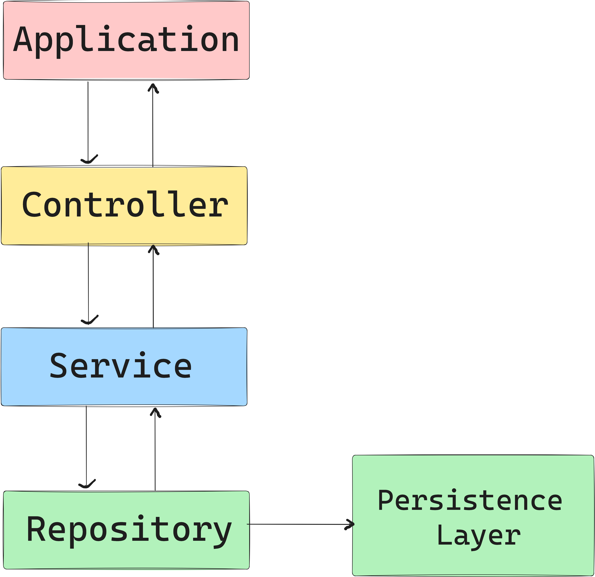

# Codebase Template

## Folder Structures

- **config**

  - This folder consists all of the configuration files such as loggers.

- **controllers**

  - This folder consists all of the APIs.
  - File Naming Convention
    - user.api.js

- **database**

  - This folder must only consists all of the configurations of a specific database.

- **middlewares**

  - This folder consists all of the middlewares to be used in the APIs in the controllers.

- **repository**

  - This folder consists all of the files related to persistence layer access.
  - Repositories File Name Convention
    - UserRepository.js

- **services**

  - This folder consists all of the services or business logic of a certain API. It also includes the ability to transform data to be be sent at the controller.
  - Services File Name Convention
    - UserService.js

- **test**

  - This folder consists all of the test files.
  - Test File Naming Convention
    - User.test.js
    - UserUnit.test.js
    - UserIntegration.test.js
    - UserRegression.test.js

- **utils**

  - This folder consists of other important classes or functions for the system. Example is Email sender.

- **.env**

  - A file that consists all of the environment variables for the app.
  - Environment Variable Naming Convention
    - NODE_ENV=stg
    - DB_HOST=localhost
    - DB_PASSWORD=password

- **.gitignore**

  - A file that consists all of the paths that will be ignored when pushing to a remote repository.

- **app.js**

  - A starting point file. This is where you include (import) all of your controllers.

- **package.json**

  - List of required packages for the app.

- **server.js**

  - A file that will start a server.

> **NOTE**: Ignore the readme-images folder

## package.json


In `package.json`, you can set the environment into testing, by running the command `npm run test`. To be able to change an environment variable in a script, install `dotenv`, and `cross-env` npm package.

## Controller - Service - Repository Pattern



This is the pattern I used for the codebase. This pattern will separate the concerns for the APIs, Business logics, and persistence layer access.

### Sample Implementation

**User Controller**

```javascript
// Service
const UserService = require("../services/UserService");

// Http Errors
const { HttpUnprocessableEntity } = require("../utils/HttpError");

// Configurations
const logger = require("../config/winston");

module.exports = (app) => {
	const service = new UserService();
	/**
	 * This function will be used by the express-validator for input validation,
	 * and to be attached to APIs middleware. */
	function validate(req, res) {
		const ERRORS = validationResult(req);

		if (!ERRORS.isEmpty()) {
			throw new HttpUnprocessableEntity(
				"Unprocessable Entity",
				ERRORS.mapped()
			);
		}
	}

	app.get("/api/v1/users", [], async (req, res) => {
		logger.info({ GET_USERS_API_REQUEST: { message: "Request" } });

		try {
			validate(req, res);

			const users = await service.GetUsers();

			logger.info({ GET_USERS_API_RESPONSE: { status: 200 } });

			return res.status(200).json({ status: 200, data: users });
		} catch (err) {
			if (err !== null) {
				logger.error({ GET_USERS_API_ERROR: { message: err.message } });

				return res
					.status(err.status)
					.json({ status: err.status, data: err.data, message: err.message });
			}

			logger.error({
				GET_USERS_API_ERROR: {
					message: "Internal Server Error",
				},
			});
			return res
				.status(500)
				.json({ status: 500, data: [], message: "Internal Server Error" });
		}
	});

	app.get("/api/v1/users/:id", [], async (req, res) => {
		const { id } = req.params;

		logger.info({ GET_USER_BY_ID_REQUEST: { user_id: id } });

		try {
			validate(req, res);

			const user = await service.FindUserById(id);

			logger.info({ GET_USER_BY_ID_RESPONSE: { status: 200 } });

			return res.status(200).json({ status: 200, data: user });
		} catch (err) {
			if (err !== null) {
				logger.error({ GET_USER_BY_ID_ERROR: { message: err.message } });

				return res
					.status(err.status)
					.json({ status: err.status, data: err.data, message: err.message });
			}

			logger.error({
				GET_USER_BY_ID_ERROR: {
					message: "Internal Server Error",
				},
			});
			return res
				.status(500)
				.json({ status: 500, data: [], message: "Internal Server Error" });
		}
	});
};
```

**User Service**

```javascript
const UserRepository = require("../repository/UserRepository");
const { HttpNotFound } = require("../utils/HttpError");

module.exports = class UserService {
	#repository; // private field

	constructor() {
		this.#repository = new UserRepository();
	}

	async GetUsers() {
		const users = await this.#repository.GetUsers();

		return users;
	}

	async FindUserById(userId) {
		const user = await this.#repository.FindUserById(userId);

		if (!user) {
			return new HttpNotFound("User Not Found", []);
		}
		return user;
	}
};
```

**User Repository**

```javascript
const mysql = require("../database/mysql");

module.exports = class UserRepository {
	GetUsers() {
		return new Promise((resolve, reject) => {
			resolve([
				{
					user_id: 1,
					name: "Nads",
				},
				{ user_id: 2, name: "Marc" },
			]);
		});
	}

	FindUserById(userId) {
		return new Promise((resolve, reject) => {
			resolve({ user_id: 1, name: "Nads" });
		});
	}
};
```
